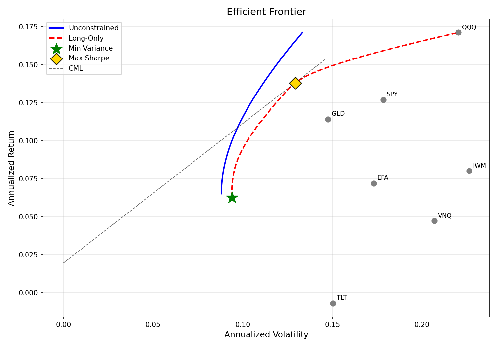

# Mean-Variance Portfolio Optimization Engine

A multi-module mean-variance portfolio optimizer built from scratch: solves for the efficient frontier with configurable constraints, validates out-of-sample via Walk-Forward, and extends with Ledoit-Wolf shrinkage for robust covariance estimation.

## Asset Universe

Seven asset-class ETFs spanning equities, fixed income, commodities, real estate, and international markets:

| Ticker | Asset Class |
|--------|------------|
| SPY | US Large Cap |
| QQQ | Nasdaq / Tech |
| IWM | US Small Cap |
| TLT | Long-Term US Treasury |
| GLD | Gold |
| VNQ | US Real Estate |
| EFA | International Developed |

**Data:** Daily adjusted close prices from Yahoo Finance, 2015-01-01 to 2025-12-31 (10 years, ~2,516 trading days).

**Risk-free rate:** Live 13-week US T-bill yield (`^IRX`), averaged over the sample period and annualized.

## Methodology

### Portfolio Optimization

Given an expected return vector $\boldsymbol{\mu}$ and covariance matrix $\boldsymbol{\Sigma}$, three optimization modes are implemented via `scipy.optimize.minimize` (SLSQP):

**Minimum Variance Portfolio (MVP)**

$$\min_{\mathbf{w}} \quad \mathbf{w}^T \boldsymbol{\Sigma} \mathbf{w}$$

$$\text{s.t.} \quad \sum w_i = 1$$

**Maximum Sharpe (Tangency) Portfolio**

$$\max_{\mathbf{w}} \quad \frac{\mathbf{w}^T \boldsymbol{\mu} - r_f}{\sqrt{\mathbf{w}^T \boldsymbol{\Sigma} \mathbf{w}}}$$

$$\text{s.t.} \quad \sum w_i = 1$$

Implemented as minimization of negative Sharpe ratio, since SLSQP is a minimizer.

**Target Return Portfolio**

$$\min_{\mathbf{w}} \quad \mathbf{w}^T \boldsymbol{\Sigma} \mathbf{w}$$

$$\text{s.t.} \quad \mathbf{w}^T \boldsymbol{\mu} = \mu_{\text{target}}, \quad \sum w_i = 1$$

Each mode supports three constraint sets:
- **Unconstrained:** short selling allowed ($w_i \in \mathbb{R}$)
- **Long-only:** $w_i \geq 0$
- **Long-only + capped:** $0 \leq w_i \leq 0.25$

### Efficient Frontier

The frontier is traced by sweeping $\mu_{\text{target}}$ from the MVP return to the maximum single-asset return (50 evenly spaced points), solving the target-return problem at each step. The Capital Market Line (CML) extends from $r_f$ through the tangency portfolio:

$$R_{\text{CML}} = r_f + \frac{R_p - r_f}{\sigma_p} \cdot \sigma$$

### Walk-Forward Out-of-Sample Validation

| Parameter | Value |
|-----------|-------|
| In-sample window | 3 years (756 trading days) |
| Out-of-sample window | 1 year (252 trading days) |
| Number of windows | 7 |
| Rebalance frequency | Quarterly (every 63 trading days) |
| Transaction fee rate | 0.0005 per unit turnover |

Per window:
1. Estimate $\boldsymbol{\mu}$ and $\boldsymbol{\Sigma}$ from in-sample data
2. Solve for max-Sharpe portfolio (long-only)
3. Apply weights to OOS period with quarterly rebalancing
4. Record OOS return, volatility, Sharpe ratio, max drawdown, and turnover

Turnover at each rebalance is defined as:

$$\text{Turnover} = \sum_{i=1}^{N} |w_i^{\text{target}} - w_i^{\text{drifted}}|$$

Transaction cost is deducted as $\text{fee\_rate} \times \text{Turnover}$ at each rebalance event.

**Baselines:**
- Equal-weight (1/N) portfolio, rebalanced quarterly
- Best in-sample asset (single asset with highest IS return, applied to OOS)

### Ledoit-Wolf Shrinkage

The sample covariance matrix $\hat{\Sigma}_{\text{sample}}$ is replaced with the shrinkage estimator:

$$\hat{\Sigma}_{\text{shrunk}} = \delta F + (1 - \delta) \hat{\Sigma}_{\text{sample}}$$

where $F$ is a structured target and $\delta \in [0, 1]$ is the optimal shrinkage intensity, computed analytically via `sklearn.covariance.LedoitWolf`. The Walk-Forward is re-run with $\hat{\Sigma}_{\text{shrunk}}$ and results are compared against the sample estimator.

## Results

### Efficient Frontier



The unconstrained frontier (blue) lies strictly to the left of the long-only frontier (red), confirming that relaxing the no-short-selling constraint expands the feasible set and reduces achievable volatility at each return level. TLT sits near zero return with ~14% volatility, reflecting the 2015–2025 rate-hiking cycle. QQQ dominates in return (~17%) but carries the highest volatility (~22%).

### Walk-Forward: Sample vs Shrinkage

| Metric | Sample | Shrinkage |
|--------|--------|-----------|
| Mean OOS Sharpe | 0.9283 | 0.9353 |
| Mean OOS Return | 0.0983 | 0.0991 |
| Mean OOS Volatility | 0.1271 | 0.1272 |
| Mean OOS MDD | −0.1231 | −0.1228 |
| Mean Turnover | 0.1148 | 0.1155 |
| **Turnover change** | — | **+0.6%** |

**Baseline comparison (Ledoit-Wolf run):**

| Strategy | Mean OOS Sharpe | Mean OOS Return |
|----------|----------------|----------------|
| Optimized (Ledoit-Wolf) | 0.9353 | 0.0991 |
| Equal-Weight (1/N) | 0.7857 | 0.0933 |
| Best In-Sample Asset | 1.0830 | 0.1994 |

### Key Findings

**1. Shrinkage has minimal impact in this setting.**

Sample and shrinkage results are nearly identical, with turnover marginally increasing (+0.6%) rather than decreasing. This is expected: with $N = 7$ assets and $T = 756$ daily observations per window, the $N/T$ ratio is approximately 0.009 — well within the regime where the sample covariance is already well-conditioned. The analytical shrinkage intensity $\delta$ is correspondingly small. Shrinkage becomes material when $N/T > 0.1$ (e.g., 50+ assets with 3-year windows).

**2. Best in-sample asset outperforms Markowitz OOS.**

The single-asset baseline achieves a higher mean OOS Sharpe (1.0830) than the optimized portfolio (0.9353). This is a well-documented phenomenon: the expected return vector $\boldsymbol{\mu}$ estimated from historical means is the least stable input to mean-variance optimization, and estimation error in $\boldsymbol{\mu}$ propagates into extreme portfolio tilts. This finding is consistent with DeMiguel, Garlappi & Uppal (2009), who show that 1/N often outperforms Markowitz in realistic settings due to estimation error.

**3. Optimized portfolio outperforms equal-weight.**

Despite the estimation error problem, the optimizer (0.9353 Sharpe) beats 1/N (0.7857), suggesting that covariance-based diversification adds value even when return estimates are noisy — the portfolio successfully avoids high-volatility, low-return assets like TLT in the 2022–2025 period.

**4. Window 5 (OOS 2022–2023) is the worst-performing fold.**

The optimizer suffered −29.13% annualized return (Sharpe: −1.67) during the 2022 rate-hike selloff, where both equities and bonds declined simultaneously, breaking the historical correlation structure estimated in-sample. This demonstrates the core fragility of mean-variance optimization: it relies on stationarity of the covariance structure.

## Project Structure

```
markowitz-portfolio-optimization/
├── data.py          # Data pipeline: prices, returns, μ, Σ, risk-free rate
├── optimize.py      # Core optimizer: MVP, max-Sharpe, target-return (3 constraint modes)
├── frontier.py      # Efficient frontier visualization with CML
├── walkforward.py   # Walk-Forward OOS validation with quarterly rebalancing
├── shrinkage.py     # Ledoit-Wolf shrinkage extension
├── main.py          # Runner script: full pipeline + comparison table
├── efficient_frontier.png
└── README.md
```

## Usage

```bash
pip install yfinance pandas numpy scipy matplotlib scikit-learn
python main.py
```

## Dependencies

- Python 3.10+
- yfinance
- pandas / numpy
- scipy (SLSQP optimizer)
- matplotlib
- scikit-learn (Ledoit-Wolf estimator)

## Limitations

1. **Expected returns from historical mean** — the least stable input to mean-variance optimization. Black-Litterman or shrinkage toward equilibrium returns would address this.
2. **Static rebalance frequency** — quarterly rebalancing is not adaptive to market regime changes (e.g., the 2022 correlation breakdown).
3. **Simplified transaction cost model** — flat fee rate with no market impact or bid-ask spread modeling.
4. **No tail-risk measure** — variance treats upside and downside symmetrically. CVaR (Conditional Value-at-Risk) optimization would penalize left-tail risk specifically.
5. **US-centric ETF universe** — results may not generalize to emerging market or single-stock universes where covariance estimation is less stable.
6. **Shrinkage limited by low dimensionality** — with only 7 assets, the sample covariance is already well-conditioned; the benefit of shrinkage would be more apparent in a 50+ asset universe.
